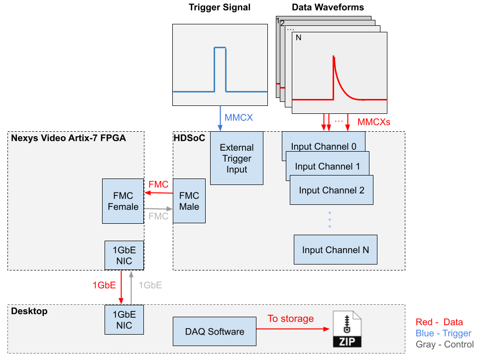
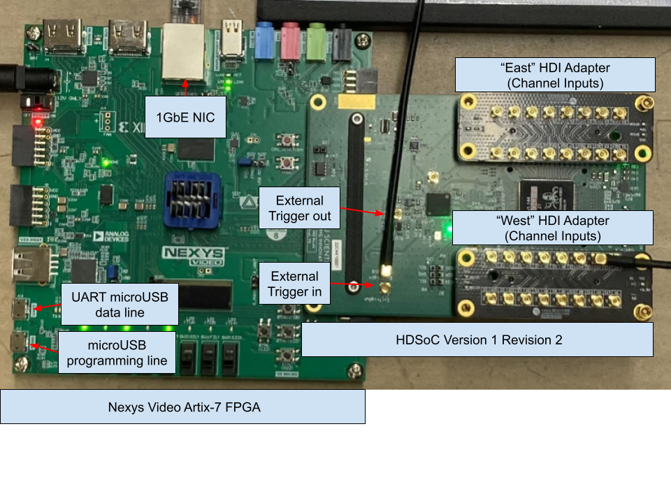

# Hardware

## General Hardware Overview
### Conceptual Diagram
{: style="max-width:100%; height:auto;"}

- **Trigger Signal**: An external signal to tell the board when to digitize the input waveforms. Should be LVCMOS25 (0-2.5V) with width 10-100 ns.
- **Waveforms**: Analog signal to be digitized. Should be LVCMOS25 (0-2.5V). Max width is 1984 nanoseconds by default, but this depends on the sampling rate (default 1Gsps).
- **HDSoC**: Digitization board that handles inputs across multiple channels. Can be set to trigger on external or internal (self) signals.
- **Nexys Video Artix-7 FPGA**: Acts as a parent board to the HDSoC. Handles 1GbE communication and firmware storage among other things.
- **Desktop**: Receives and processes events that are effectively streamed from the digitization system.

### Labled Picture
{: style="max-width:100%; height:auto;"}

---

## 1GbE NIC (Gigabit Ethernet Network Interface Card)

### Overview

These NICs are generally PCIe Cards that are "plug and play". They provide a 1 gigabit per second ethernet connection for the host computer.

### Configuration
If you machine has a GUI, you may find it easier to edit network settings that way. Otherwise, you can edit settings from command line. For example for UKY's teststand we use:
```
nmcli connection modify enp3s0 \
    ipv4.addresses 192.168.1.1/24 \
    ipv4.method manual \
    connection.autoconnect yes \
    ipv6.method ignore
```

You may need to create a connection configuration file first if it doesn't exist. For example for UKY's teststand we use:
```
nmcli connection add type ethernet con-name enp3s0 ifname enp3s0
```

In particular, the `ipv4.addresses` is important. Here the port is specified to accept any traffic on the 192.168.1.xxx subnet. See the [networking page](miscellaneous.md#networking-tutorial) for more details.

---

## Nexys A7 Video Card

### Overview

The Nexys A7 is a versatile and high-performance FPGA development board from Digilent, featuring the Xilinx Artix-7 FPGA. It is like the "mother board" for the HDSoC. For this use case it will provide power, an interface to update firmware, and an interface for data transfer. You can read more about this board on [diligent's Nexys Video Artix-7 FPGA page](https://digilent.com/shop/nexys-video-artix-7-fpga-trainer-board-for-multimedia-applications/?srsltid=AfmBOordpqUnzjcLV98y-AH6sYCWQ9arHT61rksyZw5j6ej5Duj9RDYr). 

### FMCs

#### HDSoC

The HDSoC (or other nalu board) connects to the FPGA board via an FMC connector. See [HDSoCv1 rev 2](hardware.md#hdsocv1-rev-2) for more info.

###  Wired Connections

#### USB A to microUSB

A USB A to microUSB can be used for UART communication. This can be used for data transfer via UART (very slow, limited to ~100 KB/s) and uploading firmware to the board. See the [hardware diagram](hardware.md#labled-picture) for port locations.

#### 1GbE Connection

Connect an ethernet cable between the board and a host desktop computer. Most modern ethernet cables should work. See the [hardware diagram](hardware.md#labled-picture) for port locations.

### Configuration

To congfigure the board, the appropriate firmware must be uploaded to it. This can be retrieved from [nalu scientific's board downloads page](https://support.naluscientific.com/boards/hdsocv1-evalr2/). There are several options, the easiest two are:

1. Use microSD card with loaded firmware (see [HDSoC quickstart guide](pdfs/HDSoC_quick_start.pdf))
2. Upload the firmware via Vivado

Steps to complete step 2 are below.

#### Downloading the firmware

Navigate to [Nalu Scientific's support website](https://support.naluscientific.com/faq/). Go to the page for the [HDSoCv1-evalr2]((https://support.naluscientific.com/boards/hdsocv1-evalr2/)) (or appropriate board). Download the most recent firmware version. This DAQ has been tested with firmware version 938. The file should be something like `HDSoC_eval_v938.bit`.

#### Downloading Vivado

**Note:** Vivado may take a *long* time to install because it is a very large program. This step could take serveral hours. A full Vivado installation can be around 200 GB. Below is a "minimal" installation that is ~50GB

The easiest way to upload firmware to the board is via Vivado. Download the most recent version of Vivado for your system from [Xilinx's download page](https://www.xilinx.com/support/download.html). You will need to make an account with AMD to install. This is easiest on a machine with a GUI. For a simple install follow these steps:

1. Run installer. On linux run the bin file with `/path/to/.../installer.bin`.
2. On the welcome page, hit  next
3. Enter credentials, download and install now, hit next
4. Under products to install select Vivado, hit next
5. For customizing the installation.
    1. Under "Design Tools" select only "Vivado Design Suite"
    2. Under "Devices" select only "Production Devices">"7 Series"
    3. Under "Installation Options", make sure you have "Install Cable Drivers" selected. Hit next.
6. Agree to License agreements, hit next.
7. Select which directory to install to. Hit next. Begin installation.

#### Uploading Firmware

Once Vivado is installed run it. On linux you may need to source the settings file with `source /path/to/.../Xilinx/Vivado/202x.x/settings64.sh`, then you can run the command `vivado` to launch vivado. 

A new project needs to be created. This can be a "dummy" project since we're just uploading firmware. [Step 1 of this guide](https://www.realdigital.org/doc/4ddc6ee53d1a2d71b25eaccc29cdec4b) gives all the details needed to creatae new project.

To load firmware onto the Nexys A7 using Vivado, plug the USB A to microUSB connection into the program port of the Nexys A7 board. See the [hardware diagram](hardware.md#labled-picture) for port locations. Follow these steps to upload firmware such that it persists when the board reboots:

1. **Open Vivado Hardware Manager and Connect to the Board**
   - Open Vivado and go to **Tools** > **Hardware Manager**. **Hardware Manager** should also be visible on the left sidebar of the project page.
   - In the **Hardware Manager** window, click **Open Target** and select **Auto Connect** or choose the appropriate JTAG or USB connection to connect to your board.
   If the board is connected properly, Vivado should automatically detect it.

2. **Convert the Bitstream to a Binary File**
   To program the flash, you need to convert the bitstream to a binary file. Nalu provides a `.bit` files, but we can convert the `.bit` file into a `.bin` file. Here’s how you can do it:

   - After the bitstream is generated, open a the TCL Console (**Window**>**Tcl Console**) and use the following command to generate the `.bin` file from the `.bit` file:

     ```bash
     write_flash -force -file /path/to/output/firmware.bin -bitstream /path/to/input/firmware.bit
     ```

     Replace the paths with the appropriate file locations for your system.

     Example:

     ```bash
     write_flash -force -file /home/pioneer/vivado_stuff/Nexsys_Video_A7_For_HDSoc/HDSoC_eval_v938.bin -bitstream /home/pioneer/vivado_stuff/Nexsys_Video_A7_For_HDSoc/HDSoC_eval_v938.bit
     ```

3. **Add Configuration Memory Device**
   Once the `.bin` file is ready, go back to the **Hardware Manager** in Vivado and:

   - Right-click on your connected device in the **Devices** pane (in the Hardware Manager).
   - Click **Add Configuration Memory Device**.
   - In the dialog box, select the appropriate part for your flash device. For the Nexys A7, the part number will likely be something like **S25FL256Sxxxxxx0-SPI-x1_x2_x4**.
   - Click **OK** to confirm.

4. **Program the Flash Memory**
   After selecting the configuration memory device:

   - Vivado will prompt you to **program the flash memory**.
   - Select the **firmware `.bin` file** you generated earlier.
   - Click **Program** to start the flashing process.
   The process will take some time depending on the size of your firmware file and the connection speed.

5. **Power Cycle the Device**
   After programming is complete, power down the device and power it back on. Once powered on, you should see indicators (such as green lights on the HDSoC board) signaling that the firmware has been loaded successfully.


---

## HDSoCv1 rev 2

### Overview

The HDSoC is a high density digitizer system on a chip evaluation board. It provides a flexible digitization system. The high density part makes it appealing to for use in the ATAR DAQ, as the ATAR will have thousands of channels. You can read more in the [HDSoC product sheet](pdfs/HDSoC_product_sheet.pdf) or on [Nalu Scientific's HDSoC page](https://support.naluscientific.com/boards/hdsocv1-evalr2/).

### Wired Connections

#### MMCX connector

The HDSoC's inputs (channel inputs and external trigger) and outputs (external trigger output) use a MMCX connectors. See the [labeled picture](hardware.md#labled-picture) and [conceptual diagram](hardware.md#conceptual-diagram) to see where these inputs are on the board.

### Configuration

See the [HDSoC quickstart guide](pdfs/HDSoC_quick_start.pdf). You don't need to worry about using the SD card to boot the firmware if you've already uploaded it.


---