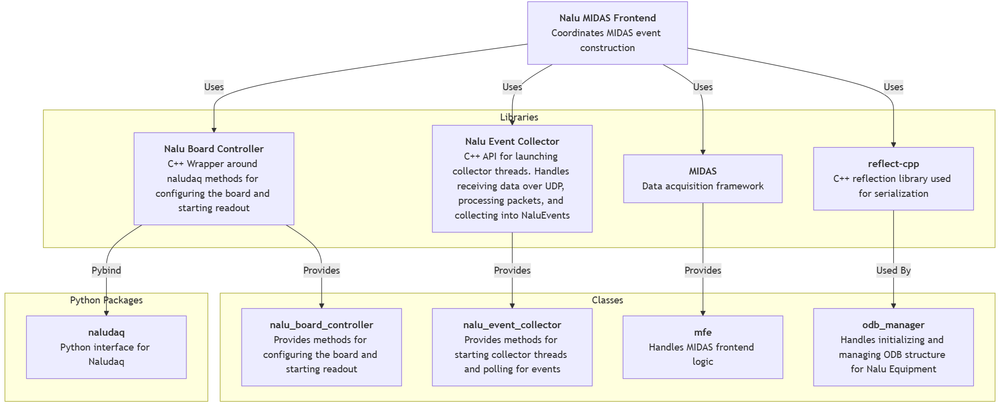

# General Sofware Overview

## Software Dependency Diagram
{: style="max-width:100%; height:auto;"}
**Note:** [an SVG version of this diagram with links to each repository is avaiable here](images/software_dependency_diagram.svg).

---

## Software Data and Control Flow Diagram
{: style="max-width:100%; height:auto;"}

- **Ethernet Controller**: The systems ethernet controller which sockets are formed on.
- **UDP Socket**: Two sockets are constructed. One by [naludaq python package](https://pypi.org/project/naludaq/0.31.9/) to communicate with the board. And one by the UDP receiver to receive data.
- **Nalu Event Collector**: A library to collect events from a UDP socket receiving events from a nalu scientific board
    - **UDP Buffer**: Receives UDP packets and puts them in a buffer to be processed.
    - **Event Buffer**: Processes UDP packets into events and puts them in a buffer.
    - **Event Collector Manager**: Manages interfacing with the buffers. I.e. getting data, configuration, etc.
- **Nalu Board Controller**: C++ methods to configure the nalu scientific board to prepare for data taking.
    - **C++ pybind wrapper**: C++ wrapper around some methods from the [naludaq python package](https://pypi.org/project/naludaq/0.31.9/).
    - **Board Controller Manager**: Manages interfacing with the board from another C++ program.
- **Midas Frontend**: Handles run control, configuration via ODB, data bank creation, etc. Interfaces with the board controller and event collector.
- **Event Builder**: Builds events from data banks provided by potentially multiple frontends. Not necessary if only using one frontend.

---

## ATAR_DAQ

### Overview

The ATAR DAQ software is a midas frontend that interfaces with several other softwares (see [software dependencies page](software.md)) to read out events from a nalu scientific board while working within the midas framework.

### Installation

Make sure you have installed the [development tools](software_dependencies.md#development-tools), [python packages](software_dependencies.md#python-packages), and [midas](software_dependencies.md#midas) before continuing. Furthmore, make sure you have [set-up access to the pioneer experiment repository](miscellaneous.md#getting-access-to-the-pioneer-repository) first.

1 **Clone the repository:**

```
git clone git@github.com:PIONEER-Experiment/atar_daq.git
```

2 **Set up the enviromment**

```
cd atar_daq/scripts/environment_setup
./detect_environment.sh
```
`environment_variables.txt` should have been generated. Check it to make sure it contains the write paths, for example, mine looks like this:
```
MIDASSYS=/home/pioneer/packages/midas
MIDAS_EXPTAB=/home/pioneer/packages/online/exptab
MIDAS_EXPT_NAME=ATAR_DAQ
ATAR_DAQ_DIR=/home/pioneer/packages/experiments/atar_daq
```

For more information on what the correct paths should look like, check [TRIUMF's midas quickstart guide](https://daq00.triumf.ca/MidasWiki/index.php/Quickstart_Linux#Environment_Variables).

After verifying the paths are correct:
```
source ./setup_environment.sh --add
```

**Note**: If you want this environment to be setup everything a user logs in on your profile, add it to your bashrc with:
```
echo 'source /path/to/.../atar_daq/scripts/environment_setup/setup_environment.sh --add --quiet' >> ~/.bashrc
```
replacing the above with the correct path to the script.

3 **Installed additionally dependencies:**

These are the dependencies neeeded to build this software. The aforementioned dependencies are more general.

```
$ATAR_DAQ_DIR/scripts/install_libraries/install_dependencies.sh
```

4 **Build**

```
$ATAR_DAQ_DIR/scripts/build.sh --overwrite
```

### Running

#### Starting a Midas Webpage

Midas provides a great user interface via their webpage. To start it, use the helper script:

```
$ATAR_DAQ/scripts/webpage_scripts/start_midas_webpage.sh
```
Then navigate to `localhost:8080` in your favorite web browser.

**Note**: For some reason, this script may need to be run twice sometimes for it to work properly.

**Note**: If the webpage doesn't appear, manually run `mhttpd` to debug the error output

#### Manually Starting the Frontend

I recommend doing this the first time to make sure everything is working properly.

```
$ATAR_DAQ_DIR/scripts/run.sh
```

#### Starting the Frontend as a Screen

Use the screening helper script
```
$ATAR_DAQ_DIR/scripts/screen_control/screen_frontend.sh -i {index}
```

**Note**: Exclusing `-i` flag will set the index to 0. This is the frontend index to support running multiple frontends.

to stop the screen
```
$ATAR_DAQ_DIR/scripts/screen_control/stop_screen.sh -i {index}
```

#### Starting the Frontend as Midas Program

See the [g-2 modified DAQ Manual's guide for adding program startup scripts](https://jaca230.github.io/teststand_daq_manual/midas/#adding-program-startup-scripts). For the start command, use the screen command above.


### Configuration

See the [ODB configuration page](odb_config.md) for a description of each ODB setting.


---
