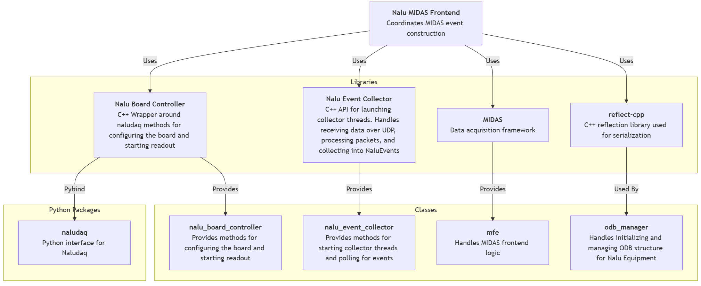
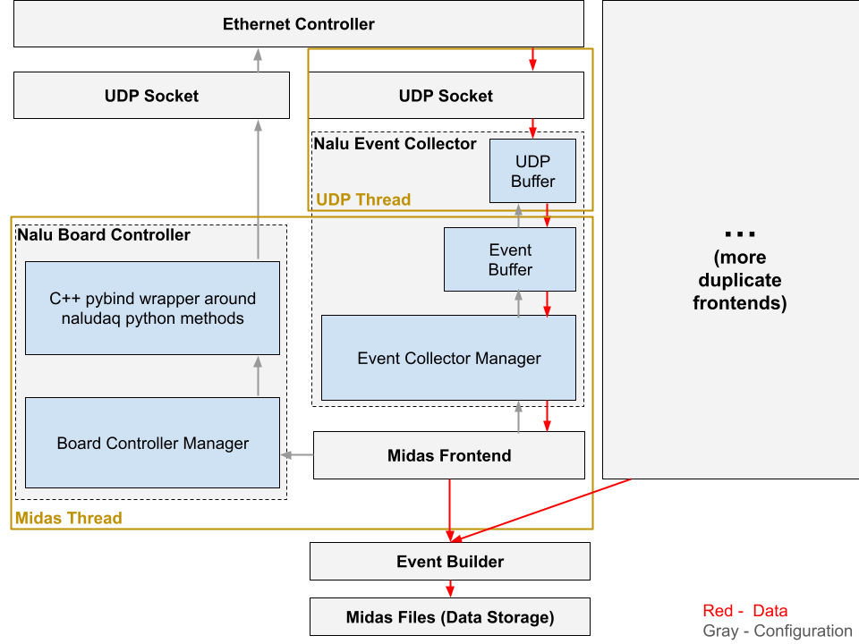

# General Sofware Overview

## Software Dependency Diagram
{: style="max-width:100%; height:auto;"}
**Note:** [an SVG version of this diagram with links to each repository is avaiable here](images/software_dependency_diagram.svg).

---

## Software Data and Control Flow Diagram
{: style="max-width:100%; height:auto;"}

- **Ethernet Controller**: The systems ethernet controller which sockets are formed on.
- **UDP Socket**: Two sockets are constructed. One by the Python board-control stack to communicate with the board and one by the UDP receiver to receive data.
- **Nalu Event Collector**: A library to collect events from a UDP socket receiving events from a nalu scientific board.
    - **UDP Buffer**: Receives UDP packets and puts them in a buffer to be processed.
    - **Event Buffer**: Processes UDP packets into events and puts them in a buffer.
    - **Event Collector Manager**: Manages interfacing with the buffers. I.e. getting data, configuration, etc.
- **Nalu Board Controller**: C++ methods to configure the nalu scientific board to prepare for data taking.
    - **C++ pybind wrapper**: C++ wrapper around the Python board-control stack.
    - **Board Controller Manager**: Manages interfacing with the board from another C++ program.
- **Midas Frontend**: Handles run control, configuration via ODB, data bank creation, etc. Interfaces with the board controller and event collector.
- **Event Builder**: Builds events from data banks provided by potentially multiple frontends. Not necessary if only using one frontend.

---

## HDSOC_DAQ

### Overview

The HDSoC DAQ software is a MIDAS frontend that interfaces with several other softwares (see [software dependencies page](software_dependencies.md)) to read out events from a nalu scientific board while working within the MIDAS framework.

The installation chain is now split into two parts:

- External dependencies that must already exist on the host, especially MIDAS and optionally ROOT.
- Dependencies that are handled by this repository itself, either through a repo-local Python virtual environment or through CPM during the CMake configure step.

### Installation

Make sure you have installed the [development tools](software_dependencies.md#development-tools), the [Python packages](software_dependencies.md#python-packages), and [MIDAS](software_dependencies.md#midas) before continuing. If you need private repository access, also make sure you have [set up access to the PIONEER experiment repository](miscellaneous.md#getting-access-to-the-pioneer-repository).

1 **Clone the repository:**

```bash
git clone git@github.com:PIONEER-Experiment/hdsoc_daq.git
cd hdsoc_daq
```

2 **Set up the environment**

The main shell entrypoint is now:

```bash
source ./scripts/environment/activate_environment.sh
```

This helper will:

- detect and save `MIDASSYS`, `MIDAS_EXPTAB`, and `MIDAS_EXPT_NAME` if needed
- create or refresh the repo-local Python environment if needed
- activate the repo-local Python environment
- isolate the runtime from user-site Python packages

If you only want to detect and save the MIDAS-related variables without activating the Python environment, run:

```bash
./scripts/environment/helpers/detect_midas_environment.sh
```

This writes:

```bash
scripts/environment/helpers/environment_variables.sh
```

Check that file to make sure it contains the correct paths. For example:

```bash
export MIDASSYS=/home/pioneer/packages/midas
export MIDAS_EXPTAB=/home/pioneer/packages/online/exptab
export MIDAS_EXPT_NAME=ATAR_DAQ
export ATAR_DAQ_DIR=/home/pioneer/packages/experiments/hdsoc_daq
```

If you want to create or refresh only the repo-local virtual environment, run:

```bash
./scripts/environment/helpers/setup_venv.sh
```

3 **Build**

Once `MIDASSYS` points to a working MIDAS install, build with:

```bash
./scripts/build.sh
```

If you want to force a clean reconfigure first:

```bash
./scripts/build.sh --overwrite
```

During the CMake configure step, CPM automatically fetches and configures several C++ dependencies, including:

- `nalu_event_collector`
- `nalu_board_controller`
- `reflect-cpp`
- `spdlog`
- `nlohmann/json`
- `pybind11`

So these no longer need to be installed manually as part of the normal `hdsoc_daq` setup flow.

### Running

#### Starting a Midas Webpage

Midas provides a great user interface via their webpage. To start it, use the helper script:

```bash
./scripts/webpage_scripts/start_midas_webpage.sh
```

Then navigate to `localhost:8080` in your favorite web browser.

**Note**: If the webpage doesn't appear, manually run `mhttpd` to debug the error output.

#### Manually Starting the Frontend

I recommend doing this the first time to make sure everything is working properly.

```bash
./scripts/run.sh -i 0
```

Some useful options are:

```bash
./scripts/run.sh --build -i 0
./scripts/run.sh --debug -i 0
./scripts/run.sh --setup-venv -i 0
./scripts/run.sh --system-python -i 0
```

#### Starting the Frontend as a Screen

Use the screening helper script:

```bash
./scripts/screen_control/screen_frontend.sh -i {index}
```

**Note**: Excluding the `-i` flag sets the index to `0`. This is the frontend index used to support running multiple frontends.

To stop the screen:

```bash
./scripts/screen_control/stop_screen.sh -i {index}
```

#### Starting the Frontend as Midas Program

See the [g-2 modified DAQ Manual's guide for adding program startup scripts](https://jaca230.github.io/teststand_daq_manual/midas/#adding-program-startup-scripts). For the start command, use the screen command above.

### Configuration

See the [ODB configuration page](odb_config.md) for a description of each ODB setting.

---
